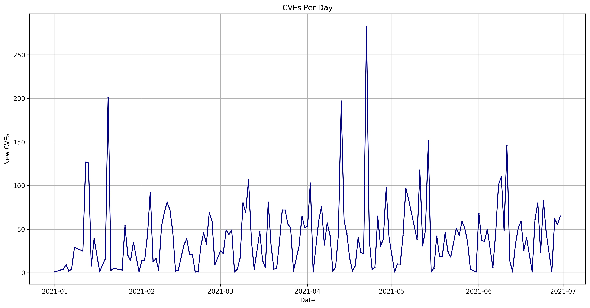
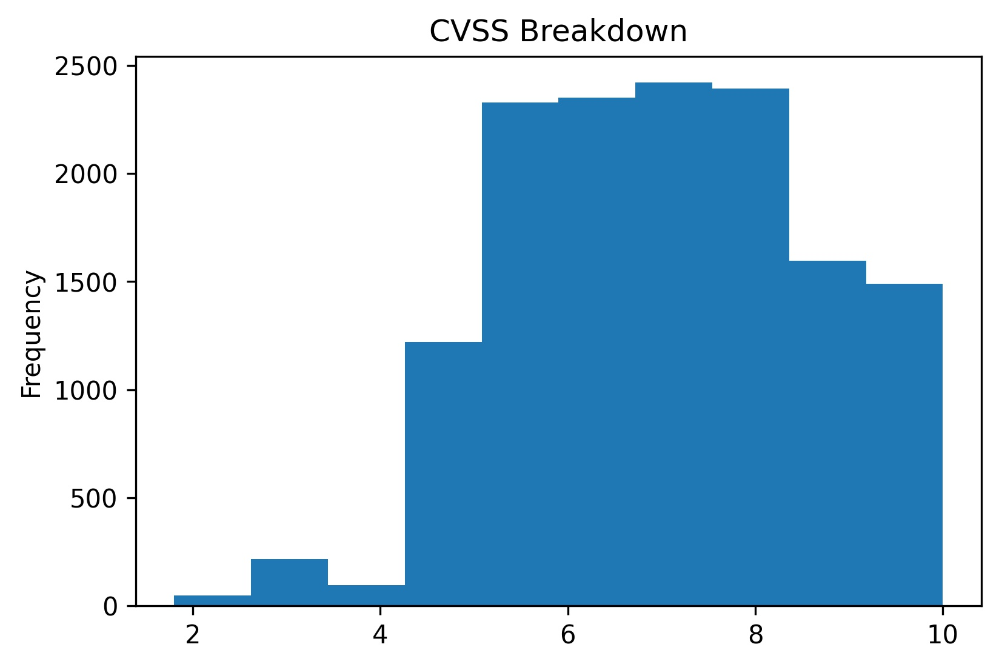

# Monthly CVE Statistics

This repository will contain the Jupyter notebooks I use to track CVE data points from [NVD](https://nvd.nist.gov/) throughout the year. My sugesstion is to open these notebooks in [Google Colab](https://colab.research.google.com).

Please feel free to open a PR or Issue with any questions or impromvements.

## CVE Data As Of The 1st August 2021

CVEs: **9536**

CVEs Published Per Day: **39.0**

Average CVSS Score:
**7.12**
