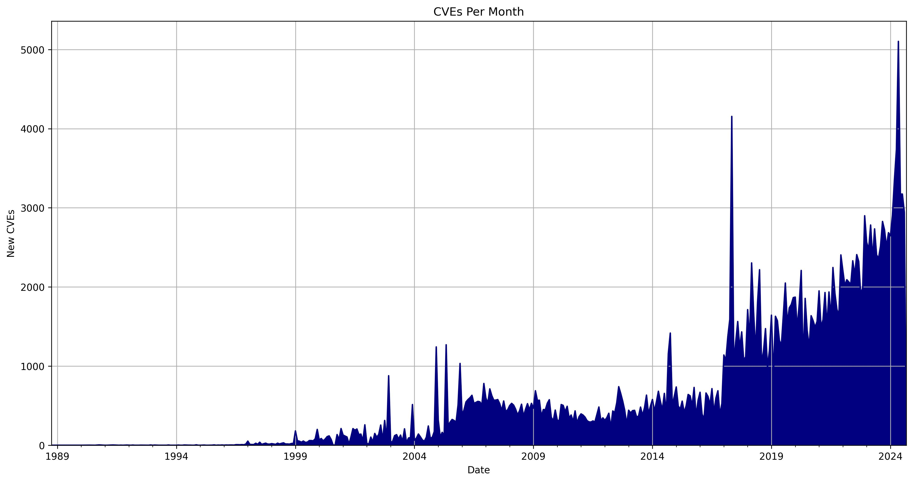
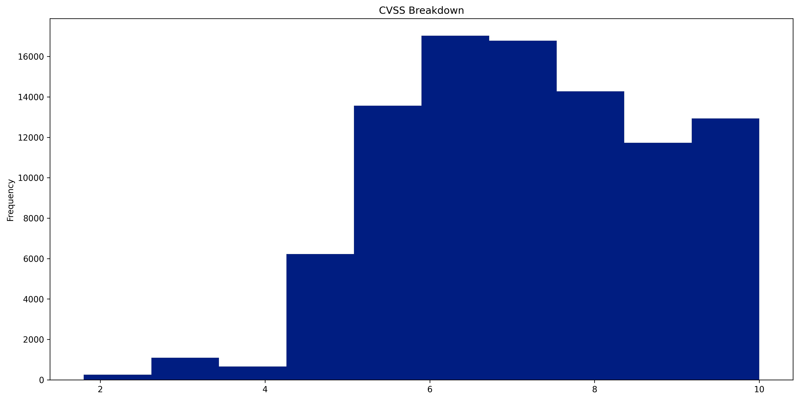

# Monthly CVE Statistics

This repository will contain the Jupyter notebooks I use to track CVE data points from [NVD](https://nvd.nist.gov/) throughout the year. My sugesstion is to open these notebooks in [Google Colab](https://colab.research.google.com).

Please feel free to open a PR or Issue with any questions or impromvements.

## CVE Data As Of The 1st of September 2023

Total Number of CVEs: **213,038** 
Average CVEs Per Day: **24.56** 
Average CVSS Score: **7.19** 

 

