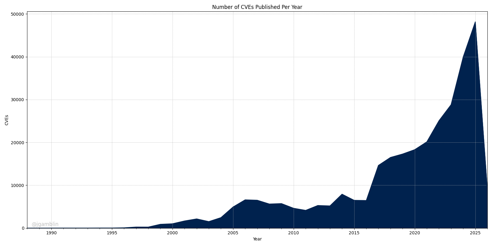
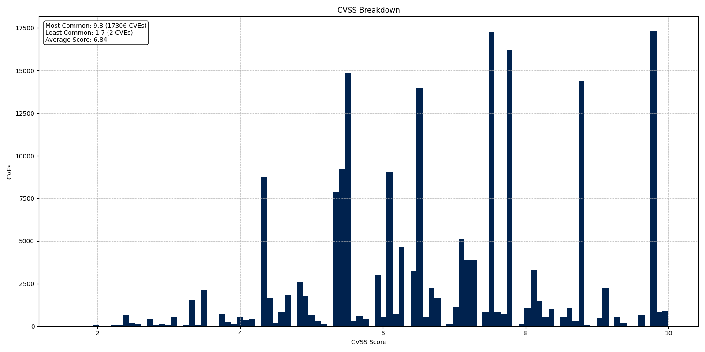

# Monthly CVE Statistics

This repository contains the Jupyter notebooks I use to track CVE data points from [NVD](https://nvd.nist.gov/) throughout the year. My suggestion is to open these notebooks in [Google Colab](https://colab.research.google.com).

Please feel free to open a PR or Issue with any questions or improvements.

## CVE Data As Of The 1st of April, 2025

Total Number of CVEs: **273,138**<br/>
Average CVEs Per Day: **29.62**<br/>
Average CVSS Score: **6.9**<br/>

<br/>


## Installation

To run these notebooks locally, you will need to have Python and Jupyter installed. You can install the required packages using:

```bash
pip install -r requirements.txt