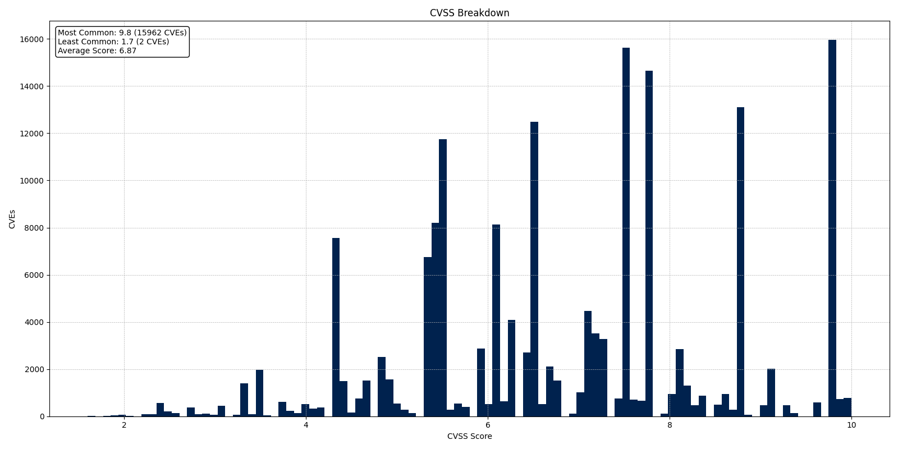

# 📊 Monthly CVE Statistics

[](https://nvd.nist.gov/)
[](LICENSE)
[](https://nvd.nist.gov/)

> **Comprehensive tracking and visualization of CVE (Common Vulnerabilities and Exposures) data from the National Vulnerability Database (NVD).**

This repository provides monthly analysis of vulnerability trends, CVSS score distributions, CNA (CVE Numbering Authority) statistics, and CWE (Common Weakness Enumeration) patterns. All data is sourced directly from [NIST's National Vulnerability Database](https://nvd.nist.gov/).

---

## 🔥 Current Statistics (December 1, 2025)

| Metric | Value |
|--------|-------|
| **Total CVEs** | 303,483 |
| **Average CVEs/Day** | 32.06 |
| **Average CVSS Score** | 6.85 |

### CVE Publication Trends


### CVSS Score Distribution


---

## 📁 Repository Structure

```
monthlyCVEStats/
├── AllData.ipynb           # Complete historical CVE analysis
├── data/
│   └── nvd.jsonl           # NVD data (download required)
├── tasks/
│   ├── auto_update.py      # Automated monthly notebook creation
│   ├── download_data.py    # NVD data downloader
│   └── test_auto_update.py # Test suite
├── 2025/                   # 2025 monthly analyses
│   ├── 2025.ipynb          # Year overview
│   ├── 2025-YOY-Graph-Days.ipynb  # Year-over-year comparison
│   ├── January/
│   ├── February/
│   └── ...
├── 2024/                   # 2024 monthly analyses
├── 2023/                   # 2023 monthly analyses
└── ...
```

---

## 🚀 Quick Start

### Prerequisites
- Python 3.10+
- Jupyter Notebook or VS Code with Jupyter extension

### Installation

```bash
# Clone the repository
git clone https://github.com/jgamblin/monthlyCVEStats.git
cd monthlyCVEStats

# Install dependencies
pip install -r requirements.txt

# Download the latest NVD data
python tasks/download_data.py
```

### Running Notebooks

**Option 1: VS Code (Recommended)**
```bash
code .
# Open any .ipynb file and run cells
```

**Option 2: Jupyter Notebook**
```bash
jupyter notebook
```

**Option 3: Google Colab**
- Upload any notebook to [Google Colab](https://colab.research.google.com)
- Upload `data/nvd.jsonl` or run the download script in Colab

---

## 📈 Available Analyses

### Monthly Reports
Each month folder contains a notebook with:
- 📅 **CVE Calendar** - Heatmap of daily CVE publications
- 📊 **Weekly/Daily Trends** - Publication patterns over time
- 🎯 **CVSS Breakdown** - Score distribution analysis
- 🏢 **Top CNAs** - Most active CVE Numbering Authorities
- 🐛 **CWE Analysis** - Most common vulnerability types

### Year-Over-Year Comparisons
- Cumulative CVE growth comparison between years
- Trend analysis and percentage changes
- Visual comparisons with annotated milestones

### Historical Analysis
- `AllData.ipynb` - Complete dataset analysis from 1999 to present
- Long-term trends and patterns
- CNA and CWE evolution over time

---

## 🔄 Automated Updates

The repository includes automation for creating new monthly notebooks:

```bash
# Create next month's notebook automatically
python tasks/auto_update.py
```

This script:
1. Copies the most recent month's notebook
2. Updates all date configurations
3. Renames files appropriately
4. Executes the new notebook

---

## 📊 Key Insights

The data reveals several important trends in vulnerability disclosure:

- **Exponential Growth**: CVE publications have grown significantly year-over-year
- **Seasonal Patterns**: Publication rates often spike around major security conferences
- **CNA Diversity**: The number of active CNAs continues to expand
- **CVSS Distribution**: Most vulnerabilities cluster around medium severity (5.0-7.5)

---

## 🤝 Contributing

Contributions are welcome! Here's how you can help:

1. **Report Issues**: Found a bug or have a suggestion? [Open an issue](https://github.com/jgamblin/monthlyCVEStats/issues)
2. **Submit PRs**: Improvements to analysis, visualizations, or documentation
3. **Share Ideas**: New metrics or analyses you'd like to see

---

## 📜 License

This project is licensed under the MIT License - see the [LICENSE](LICENSE) file for details.

---

## 🙏 Acknowledgments

- [NIST National Vulnerability Database](https://nvd.nist.gov/) for providing the CVE data
- The security research community for their continued efforts in vulnerability disclosure

---

## 📬 Contact

**Jerry Gamblin** - [@jgamblin](https://twitter.com/jgamblin) - [rogolabs.net](https://rogolabs.net)

---

<p align="center">
  <i>Tracking vulnerabilities, one CVE at a time.</i>
</p>