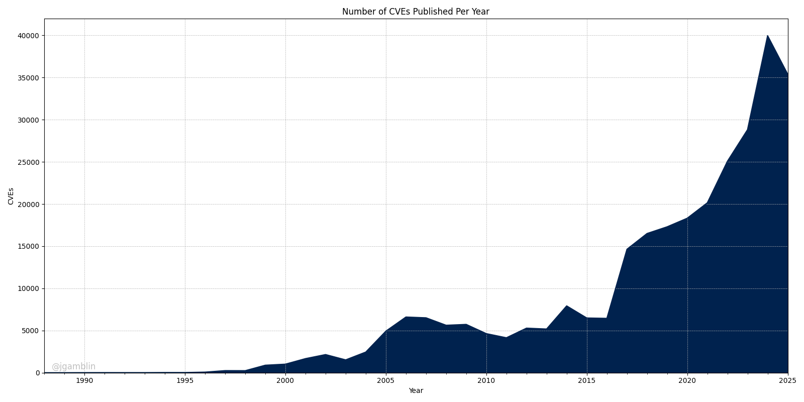

# Monthly CVE Statistics

This repository contains the Jupyter notebooks I use to track CVE data points from [NVD](https://nvd.nist.gov/) throughout the year. My suggestion is to open these notebooks in [Google Colab](https://colab.research.google.com).

Please feel free to open a PR or Issue with any questions or improvements.

## CVE Data As Of The 1st of August, 2025

Total Number of CVEs: **288,222**<br/>
Average CVEs Per Day: **30.85**<br/>
Average CVSS Score: **6.88**<br/>

<br/>


## Installation

To run these notebooks locally, you will need to have Python and Jupyter installed. You can install the required packages using:

```bash
pip install -r requirements.txt
```

## Usage

To use these notebooks:

1. Download or clone this repository.
2. Open any notebook in Jupyter, VS Code, or Google Colab.
3. Ensure you have the latest NVD data by running the provided data download scripts or following the instructions in each notebook.
4. Run the cells sequentially to generate the latest CVE statistics and visualizations.

**Data Updates:**
- The data is updated as of the 1st of each month. To refresh, rerun the download scripts and restart the notebook.

For questions or improvements, please open an Issue or PR.